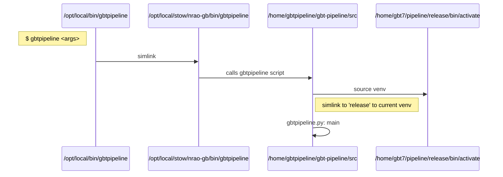

# README

This document aims to describe the process of installing a new change to the gbtpipeline environment

## What is gbtpipeline
Green Bank Telescope (GBT) calibration and mapping pipeline
This will connect to the gbtgridder. Imaging dependencies include idlToSdfits, Obit, parseltongue and AIPS.

https://safe.nrao.edu/wiki/bin/view/GB/Gbtpipeline/WebHome

Production environments are stored in ``/home/gbt7/pipeline``. Environments can be created using ``createPipelineEnv.bash``

## Sequence Diagrams
What happens when someone presses enter on ``$ gbtpipeline``?




## Update the production version
### Get your changes
```
ssh pipeline@galileo

cd /home/gbtpipeline/gbt-pipeline
# get the latest updates
git pull origin release_1.5

# if a new release then get the new branch
git checkout release_<release version>
git pull
```

### Create a new venv
```
ssh monctrl@galileo

cd /home/gbt7/pipeline
# you need the reuirements to make the venv
cp /home/gbtpipeline/gbt-pipeline/requirements.txt .
/home/gbtpipeline/gbt-pipeline/createPipelineEnv.bash gbtpipeline-v<version>-env
```

### Replace the release venv
```
# if not still in the correct env
ssh monctrl@galileo
cd /home/gbt7/pipeline

rm release
ln -s gbtpipeline-v<version>-env release
```

### All done!
You should be set then. Your new changes and venv will be called by the op/local/bin/gbtpipeline setup. See above for an diagram of that process.
